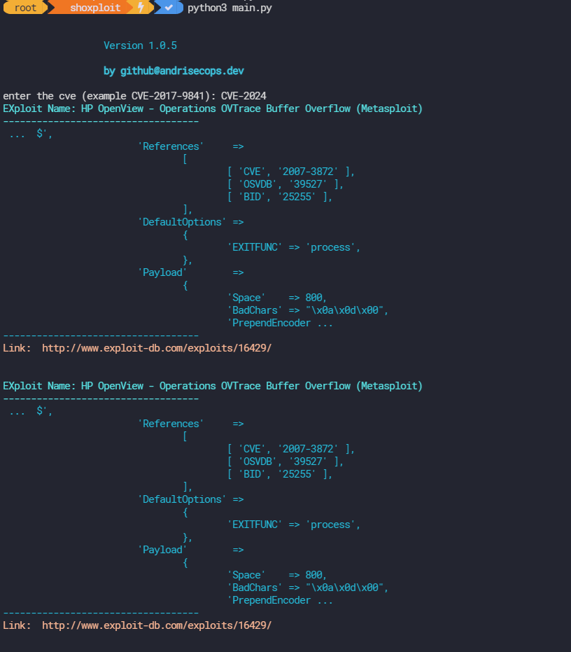

# shoxploit
Shodan-shoxploit Automatic Exploiter vulnerability scanner CVE find vulnerabilities CVE within a specific Organization.

## Usage
<details>
<summary>Usage (Drop Down)</summary>
  
### Search and output host information, cross-reference results with Searchsploit into CSV :
```
python3 shoxploit.py --api-key KEY --orgname "ORG" --output ORG.csv --search 
```

  
### Search and display host information into CSV :
```
python3 shoxploit.py --api-key KEY --orgname "ORG" --output ORG.csv
```

  
### Check your Query credits : 
```
python3 shoxploit.py --api-check --api-key 
```

  
### Help : 
```
Usage: shoxploit.py [OPTIONS]

Options:
  -on, --orgname TEXT  The name of the organization.
  -op, --output TEXT   Name of the output file.
  -ak, --api-key TEXT  Shodan API key.  [required]
  -s, --search         Search for exploits using searchsploit.
  --api-check          Check Shodan API limits.
  --help               Show this message and exit.
```
  </details>

### Tools Preview
|    shoxploit.py    |
| ------------- |
||
|    asciicast    |
[](https://asciinema.org/a/U19d2vVog7pQfQlCHP3Bx6Nkt)


  ### Author

- [@andrisecops](https://www.github.com/andrisecops)

